# arm frontend

This is a frontend application written in React Typescript.

## Running the server

To run the server, execute the following command:

```
git clone <repo-url>

npm install

npm run dev
```

The server will start on port 5173. You can access it by navigating to `http://localhost:5173/` in your web browser.

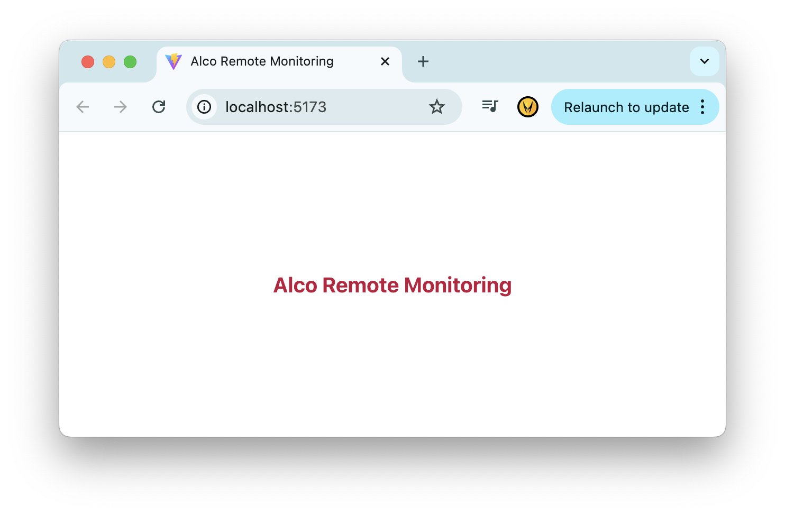

# Devops

## Overview

```
✅ Infrastructure Setup: Terraform

✅ Containerization: Podman

✅ Container Orchestration: Kubernetes - Deployment, Service, Ingress

✅ CI: Github Actions

CD: GitOps (ArgoCD)

✅ Deployment Platform: Kubernetes Cluster - EKS

✅ Configuration Managment: Helm

✅ Ingress Controller: Load Balancer - Exposed, DNS
```

## Installation for MacOS

```
brew install terraform

brew install awscli

brew install kubernetes-cli

brew install argocd

brew install helm
```

## Containerization

```
podman build -t arm-fe .

podman run -p 5173:80 <image-id>
```

## Terraform

Create ECR and EKS cluster using Terraform

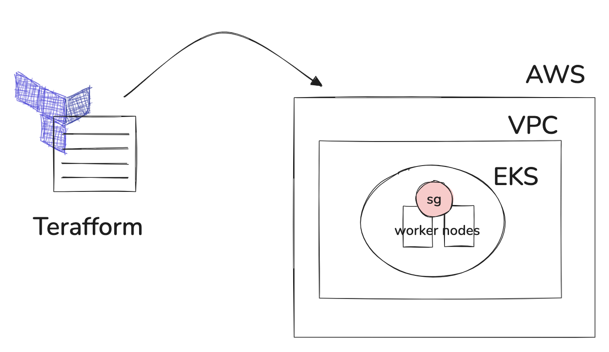

```
terraform fmt -recursive

terraform init

terraform validate

terraform plan 

terraform apply -auto-approve 

terraform destroy
```

Manual test and push image to ECR

```
aws ecr get-login-password --region ap-southeast-1 --profile default | podman login --username AWS --password-stdin <ecr-repo-url>

podman build -t arm-fe . --platform=linux/amd64

podman tag arm-fe:v1 <ecr-repo-url>:v1

podman push <ecr-repo-url>:v1
```

Configure kubectl 
```
aws eks --region <aws-region> update-kubeconfig --name <cluster-name>
```

## Automated Infrastructure

Jenkins

http://ec2-47-128-153-178.ap-southeast-1.compute.amazonaws.com:8080/

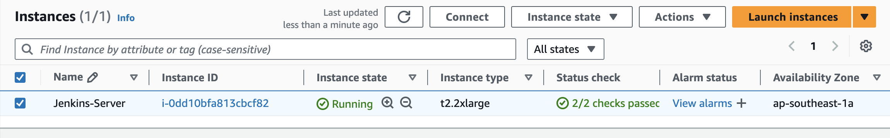

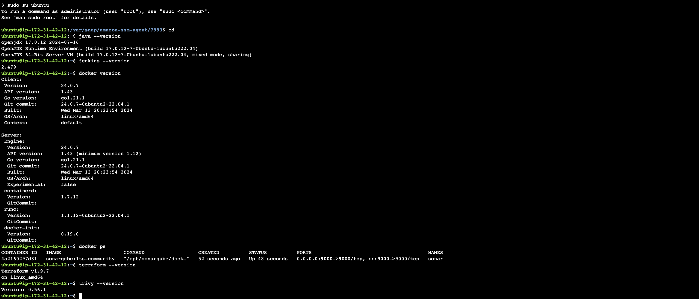

Get Jenkins admin password through SSM
```
sudo su ubuntu
cd
systemctl status jenkins.service
```

Allow Jenkins to run terraform actions

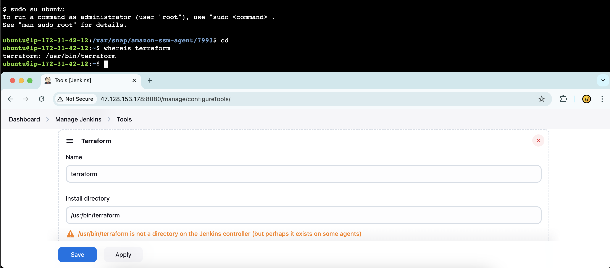

## EKS

```
export AWS_PROFILE=devops
aws eks update-kubeconfig --region <aws-region> --name <cluster-name>
kubectl cluster-info
```

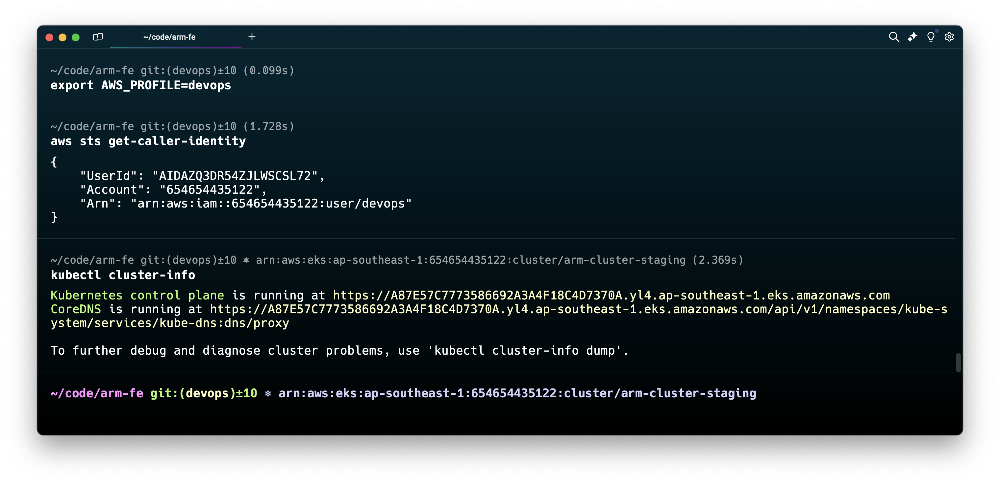

## Kubenetes Manifests to deploy application into K8 cluster

```
kubectl apply -k k8s
```

## Ingress controller

```
kubectl apply -f https://raw.githubusercontent.com/kubernetes/ingress-nginx/controller-v1.11.2/deploy/static/provider/cloud/deploy.yaml
```

Add Host name
```
sudo vim /etc/hosts
```

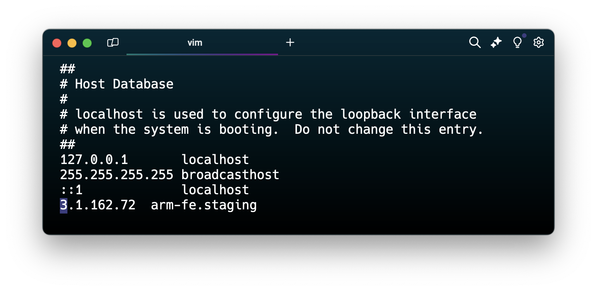

## Deploy Kubernetes Dashboard on EKS

```
DASHBOARD_VERSION="7.7.0"
helm repo add kubernetes-dashboard https://kubernetes.github.io/dashboard/

kubectl create ns kubernetes-dashboard
helm upgrade --install kubernetes-dashboard kubernetes-dashboard/kubernetes-dashboard --namespace kubernetes-dashboard --version ${DASHBOARD_VERSION}
```

# Helm

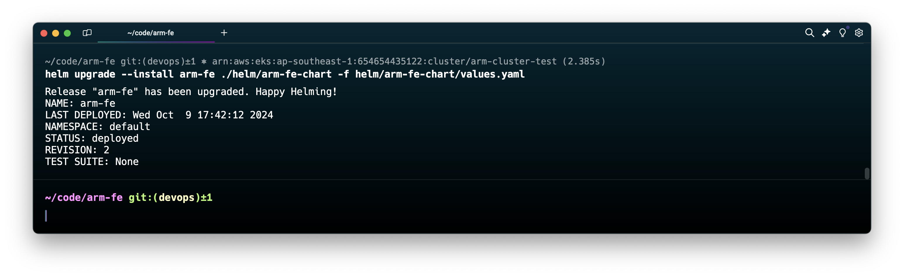

```
helm create arm-fe-chart
```

Manual deployment using Helm

```
helm upgrade --install arm-fe ./helm/arm-fe-chart -f helm/arm-fe-chart/values.yaml
```

## Configure ArgoCD on EKS

ad8a3230c58a144a29d730c4b35c0255-116444762.ap-southeast-1.elb.amazonaws.com

```
kubectl create namespace argocd
kubectl apply -n argocd -f https://raw.githubusercontent.com/argoproj/argo-cd/stable/manifests/install.yaml
kubectl patch svc argocd-server -n argocd -p '{"spec": {"type": "LoadBalancer"}}'
kubectl -n argocd get secret argocd-initial-admin-secret -o jsonpath="{.data.password}" | base64 -d; echo
```

```
kubectl get pods -n argocd
kubectl get svc argocd-server -n argocd
```

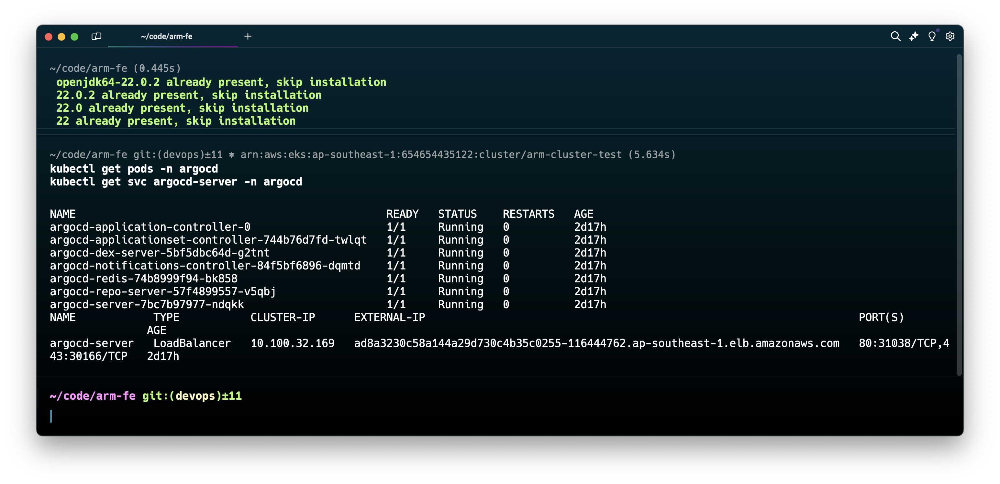

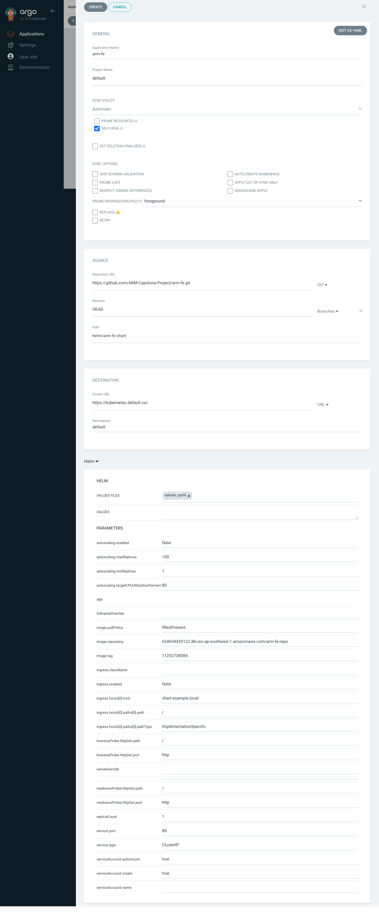

ad8a3230c58a144a29d730c4b35c0255-116444762.ap-southeast-1.elb.amazonaws.com

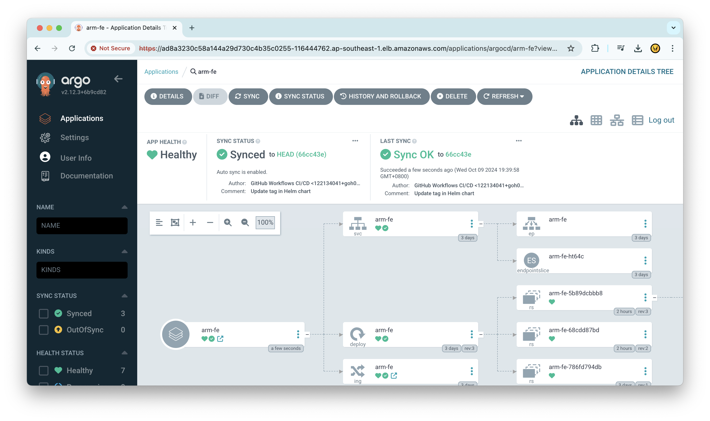

